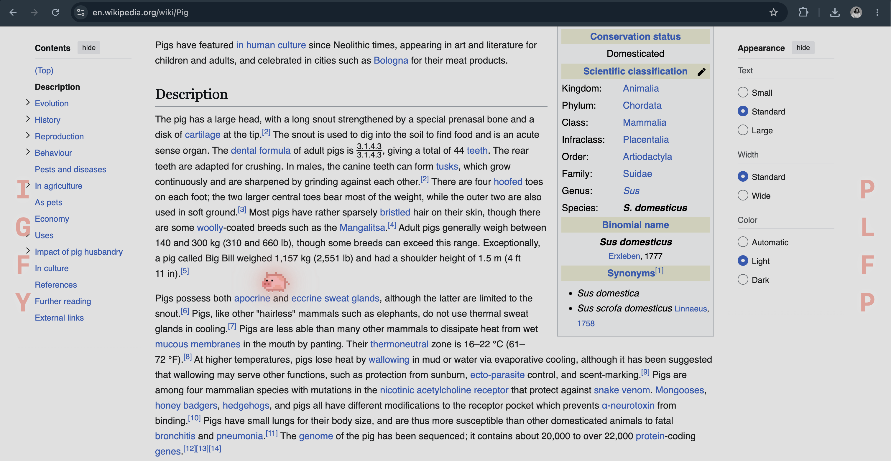

<div align="center">

# 🐷 Oinkulus

### *when pigs fly… sideways, across your screen, very calmly.*

## 🐷 A fidget for your eyes.

A tiny **macOS menu-bar** companion: a pixel pig that glides gently left ↔ right —
a calm, repetitive bit of motion to *fidget* on while you read, think, or breathe.
Look up. Breathe. Watch the pig fly.

**No windows. No clutter. No Dock icon. Just vibes.** ✨

<br/>



<br/>

`🐷 flies bilaterally` · `🅿️🅸🅶🆂🅵🅻🆈 letters` · `🌙 dims your screen` · `🖱️ click-through` · `⌘⇧E to toggle`

</div>

---

## 💭 Why I made this

I live with **anxiety and ADHD**, and reading long blocks of text can be genuinely hard — my
eyes skip, my mind wanders, and the harder I push to focus, the more restless I get.

One day I opened an article, set a little pixel pig flying across the top of it, and read
*underneath* the pig. It just… worked. I read the whole thing.

Here's what helps me, in my own experience:

- 🌿 **The gentle, repetitive motion settles my nervous system.** The steady left ↔ right
  glide is quietly calming — like watching waves.
- 🌀 **The pig adds just enough variation for my ADHD brain.** A small visual "fidget" —
  kind of like brown noise, but for your eyes. Enough novelty to stay engaged, not so much
  that it pulls focus.

If your brain works anything like mine, I hope it helps you too. 🐷💛

> 💛 Oinkulus is a gentle visual-focus / relaxation toy — this is my **personal experience**,
> not medical advice. It is **not a medical device** and makes no clinical claims. If you're
> seeking treatment, please talk to a professional.

---

## 📖 How to use it for reading

1. Open whatever you want to read — an article, a PDF, a doc.
2. Start Oinkulus (🐷 menu bar → **Start Oinkulus**, or just **⌘⇧E**).
3. Let the pig fly **over your text** and read underneath. It's *click-through*, so you can
   still scroll, click, and select normally — the pig never gets in your way.
4. Pick a **Speed** that fits your mood — slower to wind down, a touch faster when you need
   more stimulation to stay engaged.

---

## ✨ The little details

- 🐽 **It's a flying pig.** Pixel-perfect, faces the way it flies, never upside down.
- 🌊 **Smooth bilateral motion** — a calm side-to-side glide to rest your eyes on.
- 🔤 **Floating letters** that spell out `P · I · G · S · F · L · Y` and refresh at the edges.
- 🪶 **Featherweight & invisible-until-wanted** — lives in your menu bar, clicks pass right through it.
- 🐢 **Three speeds** — Slow, Medium, Fast. (Default is nice and slow.)

---

## 📥 Install (60 seconds)

1. **[⬇️ Download the latest `Oinkulus.dmg`](../../releases/latest)**
2. Open the DMG and **drag 🐷 Oinkulus into Applications**.
3. **First launch only** — because this build isn't signed by Apple yet, macOS will say it
   *"can't be checked for malicious software."* That's expected. To let your pig fly:
   - Go to **System Settings → Privacy & Security**
   - Scroll down to the **Oinkulus** notice → click **Open Anyway**
   - Confirm once more. ✅ Done forever.

---

## ▶️ Start flying

Oinkulus has **no window** — it lives up in your **menu bar** (top-right of your screen).
**It starts flying the moment you open it.** 🐷

1. Look for the **🐷 pig** in the menu bar (it turns to 💤 when paused).
2. Press **⌘⇧E** anywhere to pause/resume — or click the pig → **⏸ Pause / ▶ Start Oinkulus**.
3. That's it. The pig flies until you tell it to nap.

From that same menu you can tweak everything:

| Menu item | What it does |
|---|---|
| **▶ / ⏸ Start / Pause Oinkulus** | Launch or land the pig (⌘⇧E) |
| **Speed** | Slow · Medium · Fast |
| **Shape** | 🐷 Pig · Triangle · Circle · Diamond |
| **Side Letters** | Toggle the floating letters on/off |
| **Quit** | Send the pig home |

---

## 🛠️ Build it yourself

Requires Xcode + macOS 14 or later.

```bash
# Just build
xcodebuild -project Overlay.xcodeproj -scheme Overlay -configuration Release build

# …or build a shareable DMG
./scripts/release.sh        # → build/Oinkulus.dmg
```

<details>
<summary>🔏 Maintainer notes — signing &amp; notarization (optional)</summary>

The default build is **unsigned** (free, no Apple account). For a warning-free, notarized DMG
you need the **Apple Developer Program ($99/yr)**:

1. Create a *Developer ID Application* certificate (Xcode → Settings → Accounts).
2. Store notary credentials once:
   ```bash
   xcrun notarytool store-credentials oinkulus-notary \
     --apple-id "you@example.com" --team-id "TEAMID" --password "app-specific-password"
   ```
3. Set `DEVELOPMENT_TEAM` + `ENABLE_HARDENED_RUNTIME = YES` in `Overlay.xcodeproj` and the
   `teamID` in `ExportOptions.plist`, then run:
   ```bash
   NOTARIZE=1 ./scripts/release.sh
   ```
</details>

---

<div align="center">

Made with 🩷 and a flying pig · [MIT License](LICENSE)

</div>
