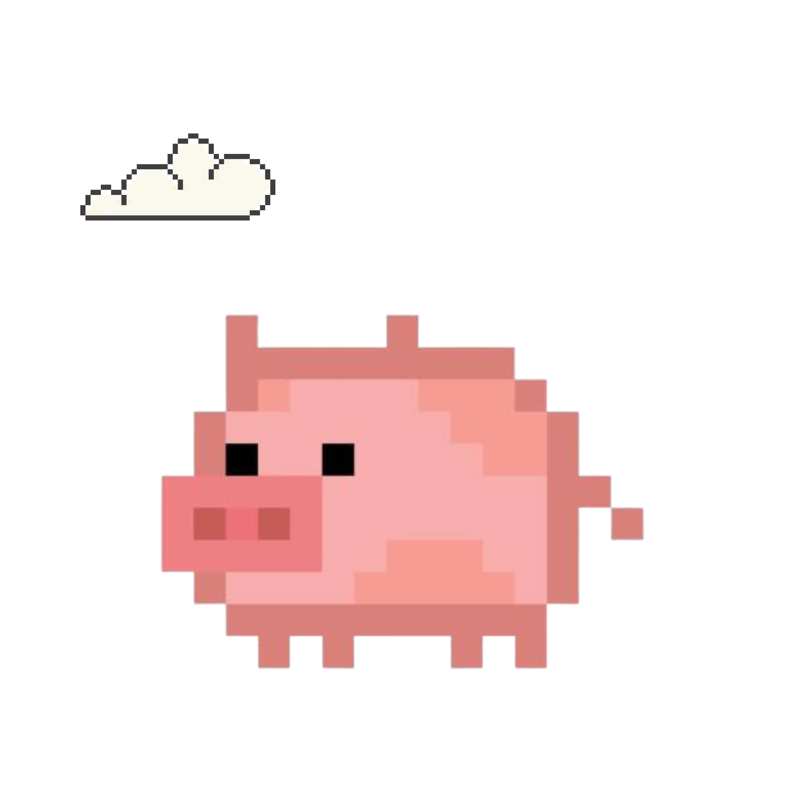

<div align="center">

# 🐷 Oinkulus

### a fidget for your eyes
A tiny **macOS** fidget app: a pixel pig that glides gently across your screen. 
<br/>
A calm, repetitive bit of motion to fidget on while you read, think, or breathe.
<br/>
No clutter. No Dock icon. Tiny menu bar icon. 🤏🏽

<br/>

`🐷 flies bilaterally` · `🖱️ change the speed` · `🅿️🅸🅶🆂🅵🅻🆈 letters`


<br/>


</div>


## 💭 Why I made this


I live with **anxiety and ADHD**, and reading long blocks of text can be hard: my eyes skip
and my mind wanders. One day I set a pixel pig flying across the top of an article and read
underneath it. It just worked.

- 🌿 **The gentle, repetitive motion settles my nervous system,** like watching waves.
- 🌀 **The pig adds just enough variation for my ADHD brain.** A small visual fidget, kind of
  like brown noise but for my eyes: enough to stay engaged, not enough to distract.

If your brain works like mine, I hope it helps you too. 🐷💛

<div align="center">

▶️ **[Watch the demo on YouTube. Try reading along to see if it helps you focus.](https://youtu.be/mjU10uMHEWc)**

<a href="https://youtu.be/mjU10uMHEWc">
  
</a>
</div>

## 📥 Install (60 seconds)


1. **[⬇️ Download the latest `Oinkulus.dmg`](../../releases/latest)**
2. Open it and **drag Oinkulus into Applications**.
3. **First launch:** this build isn't signed by Apple yet, so macOS will say it *"can't be
   checked."* Go to **System Settings → Privacy & Security**, find the Oinkulus notice, and
   click **Open Anyway**. One time only. ✅


> 🐷💛 Oinkulus is **not a medical device**
> and makes no clinical claims.

## ▶️ Using it

Oinkulus has no window. It starts flying the moment you open it and lives in your **menu bar**
as a 🐷 (which turns to 💤 when paused).

To read with it: open any article, PDF, or doc and let the pig fly over your text. It's
click-through, so you can still scroll, click, and select normally. Press **⌘⇧E** anytime to
pause or resume.

| Menu item | What it does |
|---|---|
| **▶ / ⏸ Start / Pause Oinkulus** | Launch or land the pig (⌘⇧E) |
| **Speed** | Slow, Medium, Fast |
| **Shape** | 🐷 Pig, Triangle, Circle, Diamond |
| **Side Letters** | Toggle the floating letters |
| **Quit** | Send the pig home |

---

## 🛠️ Build it yourself

Requires Xcode and macOS 14 or later.

```bash
# Build
xcodebuild -project Overlay.xcodeproj -scheme Overlay -configuration Release build

# ...or build a shareable DMG
./scripts/release.sh        # produces build/Oinkulus.dmg
```

<details>
<summary>🔏 Maintainer notes: signing &amp; notarization (optional)</summary>

The default build is **unsigned** (free, no Apple account). For a warning-free, notarized DMG
you need the **Apple Developer Program ($99/yr)**:

1. Create a *Developer ID Application* certificate (Xcode → Settings → Accounts).
2. Store notary credentials once:
   ```bash
   xcrun notarytool store-credentials oinkulus-notary \
     --apple-id "you@example.com" --team-id "TEAMID" --password "app-specific-password"
   ```
3. Set `DEVELOPMENT_TEAM` and `ENABLE_HARDENED_RUNTIME = YES` in `Overlay.xcodeproj` and the
   `teamID` in `ExportOptions.plist`, then run `NOTARIZE=1 ./scripts/release.sh`.
</details>

---

<div align="center">

Made with 🩷 and a flying pig · [MIT License](LICENSE)

</div>

<div align="center">

</div>
<br/>
